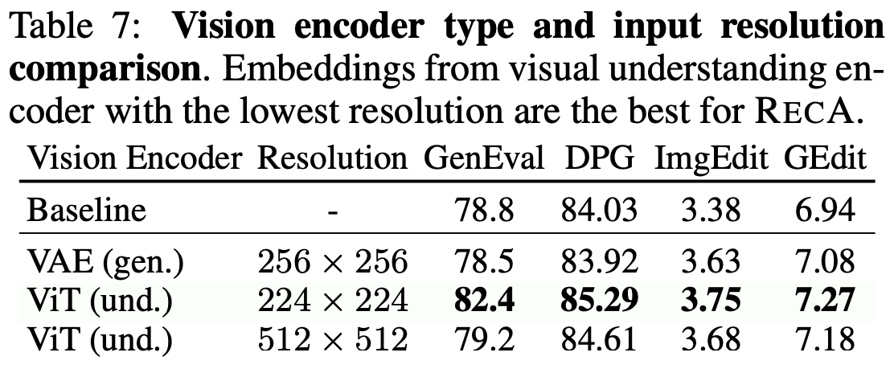
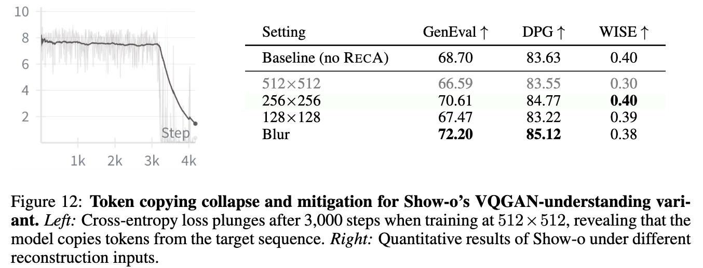

# RecA Reproduction Guide

Many people want to reproduce RecA on their own UMM architectures, but they often miss some crucial details and get suboptimal performance.

We believe the core principle of RecA is: **utilizing semantic features from images to guide image generation** — that is, **semantic-to-pixel generation enhances text-to-pixel generation**. Therefore, introducing an **information bottleneck** is essential. Otherwise, the model will take shortcuts, **degenerate into an autoencoder purely focused on reconstruction**, and ultimately lead to mode collapse. So what should we pay attention to?

## 360 Prompt Templates

We provide 360 prompts for reconstruction. You can find them [here](./BAGEL/data/consts.py).

For architectures like Show-o, we found that using diverse prompts significantly improves reconstruction quality compared to using only a single prompt like "Describe the image". For Harmon, using 360 prompts shows little difference, so this appears to be model-dependent. However, using 360 prompts is always a safe choice.

## Resize Input Images to Minimum Resolution

You need to resize the input images to the **minimum acceptable resolution** that the model uses during **image-to-text training**. For example:

- **BAGEL**: 224×224
- **Show-o (VQGAN variant)**: 256×256

**Why?** Many studies have found that higher-resolution visual understanding embeddings retain more pixel-level details. To encourage the model to focus on semantic-level reconstruction rather than pixel-level copying, we scale input images down to the minimum resolution acceptable by the UMM. This helps the model learn more abstract semantic representations during RecA training. Our ablation study in the paper validates this:

  

**More interestingly**: If the input image resolution matches the generation resolution and they share a **unified representation space** (e.g., both are VQGAN tokens, or both are SigLIP features like in RAE), the model can easily learn to simply copy-and-paste, leading to mode collapse. Taking Show-o's VQGAN variant as an example: if we input a 512×512 image (corresponding to 16×16 VQ tokens) and ask it to reconstruct 16×16 VQ tokens, the model's internal representation space collapses, and the CE loss drops to 0 after just a few thousand training steps. Scaling the input image to 256×256 solves this (preferred solution), or you can blur the input images (fallback solution).

**For Janus**: Although both input and output resolutions are 384×384, the input uses SigLIP features and the output uses VQGAN features, so there's a natural information bottleneck between them, and no special treatment is needed.

## Freeze Understanding Components as Much as Possible

For models with **decoupled** generation and understanding modules (e.g., BAGEL and MetaQuery-like architectures), freeze the understanding components whenever possible.

For models with **shared parameters** (such as Janus, Show-o, Harmon), we cannot freeze the understanding components. Therefore, we must include image-to-text data to maintain the model's understanding capabilities. Otherwise, the model's internal representation space may collapse, and generation capabilities may also degrade.